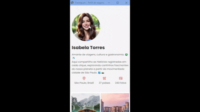

# 📸 Travelgram - Perfil de Viagens

Este é um projeto de layout para um perfil de uma rede social de fotos de viagem. Ele foi desenvolvido como parte da formação Full-stack da <a href="https://www.rocketseat.com.br/formacao/fullstack">rocketseat</a>, aplicando conceitos de **HTML, CSS e responsividade**.

## 🖥️ Sobre o Projeto

O design original foi criado no **Figma**, focado apenas na versão **Desktop**. No entanto, utilizando a abordagem **Mobile-First**, o layout foi estilizado para telas menores e, posteriormente, ajustado para telas maiores com **media queries**.

## 📷 Preview  

<p align="center">
  <a href="https://brunotxrs.github.io/travelgram/"></a>
</p>

## 🛠️ Tecnologias Utilizadas 

-   → Estruturação da página 

-  → Estilização e responsividade

-  → Layout do projeto

## 📂 Estrutura do Projeto

```plaintext

📦 Travelgram 
 ├── 📂 src 
 │ ├── 📂 assets      # Imagens, ícones e favicon do projeto
 │ └── 📂 styles 
 │   ├── global.css   # Estilos globais e variáveis 
 │   ├── index.css    # Estilos gerais e responsividade 
 │   ├── nav.css      # Estilização do menu de navegação 
 │   ├── header.css   # Estilização do cabeçalho 
 │   ├── main.css     # Estilização da galeria de imagens
 │   └── footer.css   # Estilização do rodapé
 ├── 📄 index.html   # Estrutura principal da página
 ├── 📄 License      # MIT License
 └── 📄 README.md    # Documentação do projeto
```

## 🎨 Layout

O design apresenta um **perfil de usuário**, destacando **nome, foto, localização e estatísticas de viagem**. Abaixo, há uma **galeria de fotos** organizadas de forma responsiva.

Você pode visualizar o layout do projeto através [clicando aqui](https://www.figma.com/community/file/1360315496868719817/perfil-de-viagens). É necessário ter conta no [Figma](https://figma.com) para acessá-lo.

## 📱 Responsividade

- Mobile-First: O layout foi primeiro desenvolvido para dispositivos móveis.  
- Media Queries: Ajustes foram feitos para garantir uma boa experiência em telas maiores.

## 🚀 Como Rodar o Projeto  

1. Clone este repositório:  
   ```sh
   git clone https://github.com/brunotxrs/travelgram

   ```
2. Acesse a pasta do projeto:  
   ```sh
   cd travelgram
   ```
3. Abra o arquivo `index.html` em um navegador.

---
## ✨ Developer

👨‍💻 Create by Dev Front-End <strong>Bruno Teixeira</strong>

- [](https://www.linkedin.com/in/brunotxrs/)

- [](https://github.com/brunotxrs)
